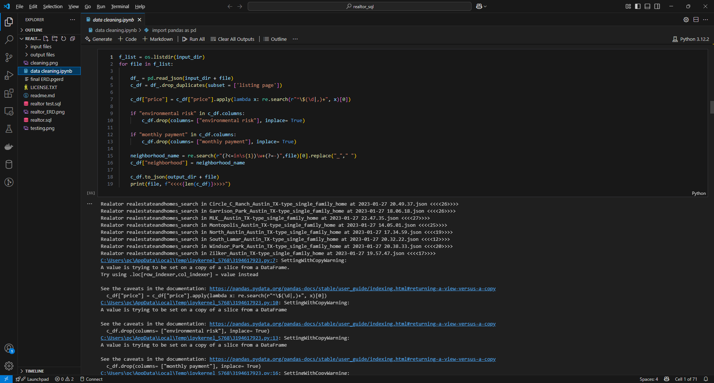
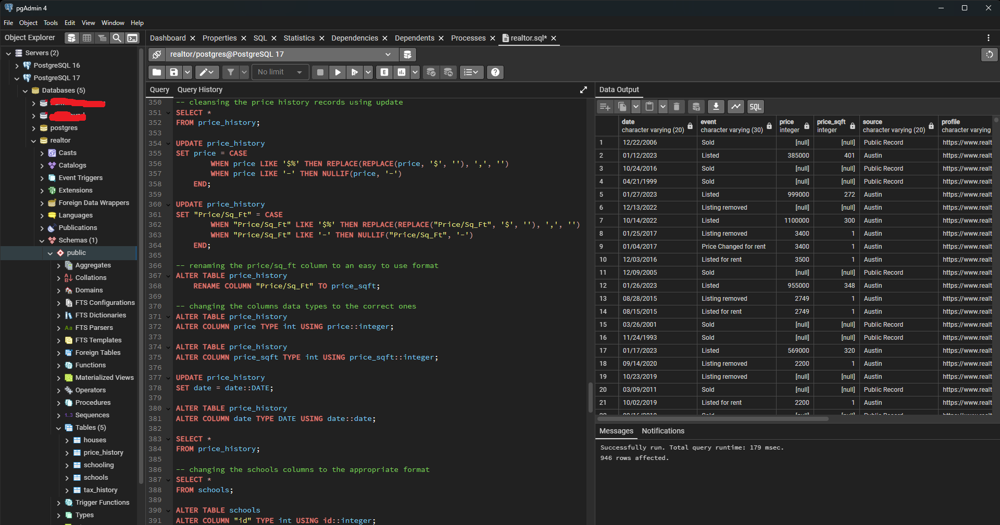
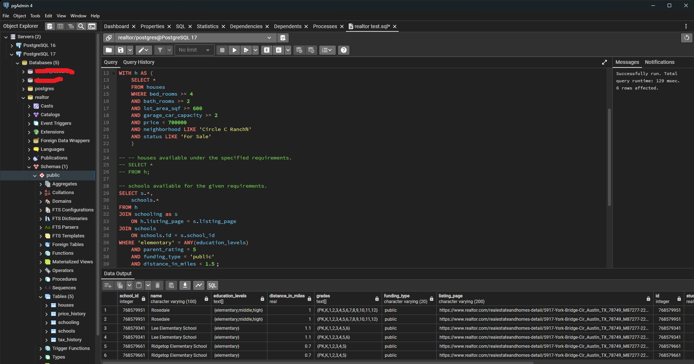
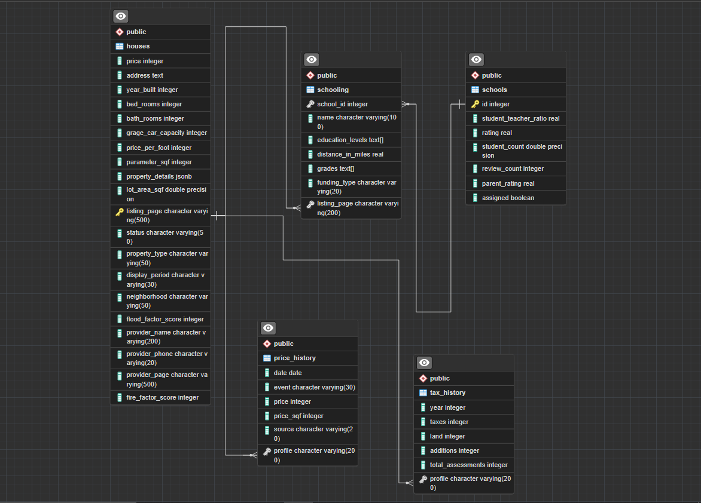
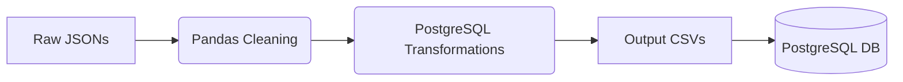

# 🏠 Realtor Database ETL Pipeline  

---

## 📌 **Overview**  
This project demonstrates an end-to-end pipeline to:  
1. Scrape real estate data from web sources (JSON) using **[SCRAPED AS JSON Project](https://github.com/yourusername/scraped-as-json)**.  
2. Cleanse and transform raw data using **Python (Pandas)** and **PostgreSQL**.  
3. Design an optimized database schema with rigorous testing.  

---

## 🛠️ **Workflow**  
### 1. **Data Extraction**  
- **Input Files**: Neighborhood-specific JSON files (e.g., `Zilker_Austin_TX.json`).  
- **Tools**: Custom web scraper ([SCRAPED AS JSON](https://github.com/...)).  

### 2. **Data Cleansing**  
- **Python**: Initial cleaning with Pandas.  
    
- **PostgreSQL**: Schema-specific transformations.  
    

### 3. **Database Build**  
- **Schema**: Designed for query efficiency.  
  ```sql  
  psql -U [username] -d [dbname] -a -f realtor.sql  
  ```  

### 4. **Validation & Testing**  
- **Test Queries**: Validates functionality.  
    - Run the SQL queries found in "realtor test.sql". 
    
- **Test Results**:  
    

---

## 📂 **Repository Structure**  
```bash  
realtor-database/  
│  
├── input_files/                          # Raw scraped JSON data  
│   ├── Realator realestateandhomes_search in Circle_C_Ranch_Austin_TX-type_single_family_home at 2023-01-27 20.49.37.json  
│   ├── Realator realestateandhomes_search in Zilker_Austin_TX-type_single_family_home at 2023-01-27 19.57.47.json  
│   └── ... (8 neighborhood JSONs)  
│  
├── output_files/                         # Processed data (with python)  
│   ├── austin_neighborhoods.csv  
│   ├── price_history_all.csv  
│   ├── schools_all.csv  
│   └── tax_history_all.csv  
│  
├── data_cleaning.ipynb                   # Pandas-based cleansing  
├── realtor.sql                           # PostgreSQL schema & transformations  
├── realtor_test.sql                      # Validation queries  
├── realtor_ERD.png                       # Entity-Relationship Diagram  
├── LICENSE.TXT                           # Usage terms  
└── readme.md                             # Documentation  
```  

---

## 🗄️ **Database Schema**  
  

---

## 📊 **Data Pipeline**  

## Prerequisites
- Python 3.x
- Pandas (`pip install pandas`)